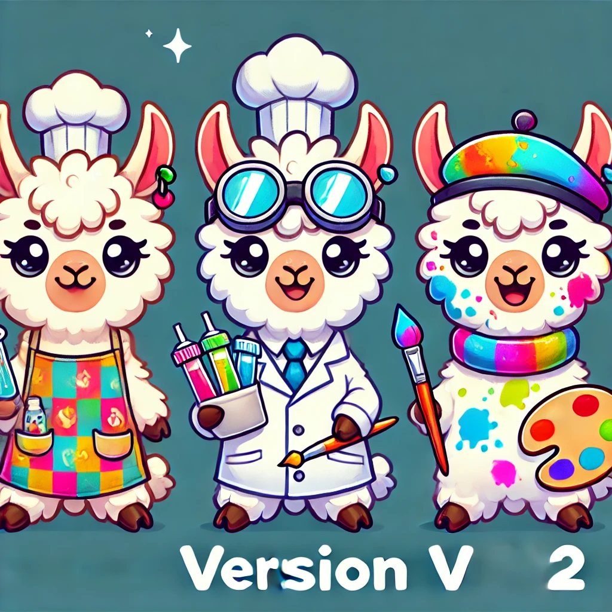

<div align="center">
  <h1>LLaMA-MoE: Building Mixture-of-Experts from LLaMA with Continual Pre-training</h1>
  <br />
  <span style="color:red">📢 <strong><i>A SMALLER AFFORDABLE MoE MODEL FOR EVERYONE!!</i></strong></span>
  <div>
    <a href="https://huggingface.co/LLaMA-MoE-v2" target="_blank">🤗 Model Weights</a> | <a href="#quick-start">🚀 Quick Start</a> | <a href="#installation">⚙️ Installation Guide</a> | <a href="#expert-construction">🚧 Expert Construction</a> | <a href="#sft">💬 Supervised Fine-Tuning (SFT)</a> | <a href="#evaluation">💎 Evaluation</a>
  </div>
</div>

<h2 id="llama-moe">🎉 Introduction</h2>

LLaMA-MoE-v2 is a series of open-sourced Mixture-of-Expert (MoE) models based on [LLaMA3](https://github.com/facebookresearch/llama).
We build LLaMA-MoE with the following two steps:
1. Partition LLaMA's FFN layers and Attention layers into sparse experts and insert top-K gate for each layer of experts.
2. Supervised fine-tuning initialization of the MoE model using 2.5B open-source token data and a two-stage training approach.


<h2 id="features">🔥 Features</h2>

1. **Lightweight Models**: The number of activated model parameters is only 3.0~3.5B, which is friendly for deployment and research usage.
2. **Multiple MoE Router Initialization**:
   1. post-hoc clustering
   2. k-means clustering
3. **Multiple Expert Construction Methods**:
   1. random split gradient(vanilla)
   2. residual split gradient
4. **Attention MoE**: supports the MoE division of the attention layers and the MLP layers.
5. **Two-stage&Open-source data for SFT**
   - First-stage:
     - [OpenHermes-2.5](https://huggingface.co/datasets/teknium/OpenHermes-2.5)
     - [SlimOrca](https://huggingface.co/datasets/Open-Orca/SlimOrca)
     - [sharegpt_gpt4](https://huggingface.co/datasets/shibing624/sharegpt_gpt4)
     - [lima](https://huggingface.co/datasets/GAIR/lima)
     - [Infinity-Instruct](https://huggingface.co/datasets/BAAI/Infinity-Instruct)
     - [Llama-3-Magpie-Air-3M-v0.1](https://huggingface.co/datasets/Magpie-Align/Llama-3-Magpie-Air-3M-v0.1)
   - Two-stage:
     - [Infinity-Instruct](https://huggingface.co/datasets/BAAI/Infinity-Instruct)
     - [MetaMathQA](https://huggingface.co/datasets/meta-math/MetaMathQA)
6. **Packed Padding Training**
7. **Multiple Instruct Model Construction**
   - [Llama3-8B](https://huggingface.co/meta-llama/Meta-Llama-3-8B-Instruct)


<h2 id="quick-start">🚀 QuickStart</h2>

```python
# python>=3.10

import torch
from transformers import AutoTokenizer, AutoModelForCausalLM

model_dir = "LLaMA-MoE-v2/LLaMA-MoE-v2-3_5B-2_8"
tokenizer = AutoTokenizer.from_pretrained(model_dir, trust_remote_code=True)
model = AutoModelForCausalLM.from_pretrained(model_dir, torch_dtype=torch.bfloat16, trust_remote_code=True)
model.eval()
model.to("cuda:0")

input_text = "Suzhou is famous of"
inputs = tokenizer(input_text, return_tensors="pt")
inputs = inputs.to("cuda:0")

pred = model.generate(**inputs, max_length=50, temperature=0.0)
print(tokenizer.decode(pred.cpu()[0], skip_special_tokens=True))
# Suzhou is famous of its beautiful gardens. The most famous one is the Humble Administrator's Garden. It is a classical Chinese garden with a history of more than 600 years. The garden is divided into three
```

<h2 id="installation">⚙️ Installation</h2>

1. Prepare conda environment: `conda create -n smoe python=3.11` (If your environment name is not `smoe`, you may need to change environment in launching scripts)
2. Add correct environment variables in `~/.bashrc` (`gcc` is set to newer version for installing `flash-attn`). e.g.:
    ```bash
    export PATH=/mnt/petrelfs/share/cuda-11.8/bin:$PATH
    export LD_LIBRARY_PATH=/mnt/petrelfs/share/cuda-11.8/lib64:$LD_LIBRARY_PATH
    export PATH=/mnt/petrelfs/share/gcc-10.1.0/bin:$PATH
    export LD_LIBRARY_PATH=/mnt/petrelfs/share/gcc-10.1.0/lib64:$LD_LIBRARY_PATH
    ```
3. Take the variables into effect: `source ~/.bashrc`
4. Install PyTorch (CUDA-11.8): `pip3 install torch torchvision torchaudio --index-url https://download.pytorch.org/whl/cu118`
5. Install dependencies: `pip install -r requirements.txt`
6. Install `flash-attn`: `pip install flash-attn==2.6.1 --no-build-isolation`. You may need to follow the [flash-attn installation instructions](https://github.com/Dao-AILab/flash-attention?tab=readme-ov-file#installation-and-features) to avoid some errors.
7. Install the latest Git: `conda install git`
8. Clone the repo: `git@github.com:LLaMA-MoE/LLaMA-MoE-v2.git` (If you don't setup the ssh key to GitHub, you may not able to clone through ssh. Check the [docs](https://docs.github.com/en/authentication/connecting-to-github-with-ssh/adding-a-new-ssh-key-to-your-github-account) about it.)
9. Change current directory: `cd LLaMA-MoE-v2`
10. Install `smoe` in [editable mode](https://pip.pypa.io/en/stable/cli/pip_install/#cmdoption-e): `pip install -e .[dev]`
11. Setup `pre-commit` hooks: `pre-commit install`


<h2 id="performance">📊 Model Performance</h2>

| Model                     | \#Activated Experts | \#Experts | \#Activated Params |                      SFT Model                                  |
| :------------------------ | :-----------------: | :-------: | :----------------: | :------------------------------------: |
| **LLaMA-MoE-3.5B (2/8)**  |          2          |     8     |        3.5B        | [🤗 SFT](https://huggingface.co/LLaMA-MoE-v2/LLaMA-MoE-v2-3_5B-2_8)    |
| **LLaMA-MoE-3.5B (1+1/7)**|          2          |     8     |        3.5B        | [🤗 SFT](https://huggingface.co/LLaMA-MoE-v2/LLaMA-MoE-v2-3_5B-1_1_7)  |

- Instructed models

| Model                                                                                 | BoolQ(32)|   SciQ   |   PIQA   | WinoGrande | ARC-c(25)| TruthfulQA | HellaSwag(10)  |  MMLU(5) |  GSM8k(8)  | HumanEval|  IFEval  |
| :------------------------------------------------------------------------------------ | :------: | :------: | :------: | :--------: | :------: | :--------: | :------------: | :------: | :--------: | :------: | :------: |
| [LLaMA3-8B](https://huggingface.co/meta-llama/Meta-Llama-3-8B-Instruct)               |   83.0   |   93.2   |   78.5   |    71.7    |   61.9   |    51.7       |      78.8      |   67.2   |    76.5    |   71.4   |   76.5   |
| [INCITE-3B](https://huggingface.co/togethercomputer/RedPajama-INCITE-Instruct-3B-v1)  |   66.5   |   94.7   |   74.4   |    63.1    |   40.2   |    36.4       |      65.6      |   25.1   |    2.12    |   6.92   |   30.1   |
| [Ministral-3b](https://huggingface.co/ministral/Ministral-3b-instruct)                |   67.6   |   76.8   |   75.8   |    64.2    |   41.1   |    47.7       |      71.3      |   28.3   |    1.90    |   3.29   |   28.8   |
| [Sheared-LLaMA-2.7B](https://huggingface.co/princeton-nlp/Sheared-LLaMA-2.7B-ShareGPT)|   41.3   |   56.6   |   60.1   |    51.9    |   28.8   |    47.6       |      39.0      |   25.4   |    0.38    |   3.11   |   24.2   |
| [Gemma-2-2b](https://huggingface.co/google/gemma-2-2b-it)                             |   72.3   |   75.8   |   67.5   |    51.1    |   52.6   |    50.8       |      69.0      |   53.0   |    26.3    |   46.1   |   34.9   |
| [Salamandra-2b](https://huggingface.co/BSC-LT/salamandra-2b-instruct)                 |   68.0   |   89.8   |   74.7   |    59.4    |   46.3   |    43.4       |      62.3      |   25.1   |    1.90    |   5.82   |   27.7   |
| [SmolLM2-1.7B](https://huggingface.co/HuggingFaceTB/SmolLM2-1.7B-Instruct)            |   68.2   |   84.3   |   76.0   |    67.9    |   53.2   |    39.9       |      72.6      |   50.4   |    38.5    |   39.1   |   29.0   |
| [OpenMoE-3B-9B](https://huggingface.co/OrionZheng/openmoe-8b-chat)                    |   61.7   |   68.4   |   65.7   |    52.6    |   33.3   |    40.5       |      56.5      |   26.5   |    1.36    |   1.01   |   31.2   |
| [LLaMA-MoE-3B-7B](https://huggingface.co/llama-moe/LLaMA-MoE-v1-3_5B-2_8-sft)         |   68.1   |   88.8   |   77.9   |    66.5    |   44.0   |    33.3       |      73.2      |   28.2   |    4.62    |   12.0   |   28.1   |
| [OLMoE-1B-7B](https://huggingface.co/allenai/OLMoE-1B-7B-0924-SFT)                    |   80.9   |   94.9   |   80.1   |    69.1    |   55.6   |    43.3       |      79.6      |   53.8   |    40.9    |   40.5   |   35.5   |
| **MLP-MoE (8top2)**                                                                   |   74.6   |   90.6   |   68.8   |    55.7    |   42.8   |    44.7       |      59.0      |   40.6   |    53.1    |   53.5   |   32.7   |
| **MLP-MoE (1+7top1)**                                                                 |   76.9   |   88.8   |   67.9   |    57.7    |   40.1   |    45.3       |      52.7      |   42.7   |    55.0    |   51.2   |   36.0 |


<h2 id="expert-construction">🚧 Expert Construction</h2>

- Vanilla LLaMA-MoE-v2: `sbatch scripts/expert_construction/convert/convert_mixtral_v2.sh`
- Residual LLaMA-MoE-v2: `sbatch scripts/expert_construction/convert/convert_mixtral_residual_v2.sh`

For more information, please refer to [Expert Construction docs](docs/expert_construction/README.md).


<h2 id="sft">💬 Supervised Fine-Tuning (SFT)</h2>

- **NOTICE:** Please create `logs/` folder manually: `mkdir -p logs`
We provide simple examples of SFT to build chatbots.
Please refer to [SFT docs](docs/supervised_fine_tuning/LLaMA-MoE-v2.md) and `/mnt/petrelfs/zhutong/smoe/scripts/sft` for more details.


<h2 id="evaluation">💎 Evaluation</h2>

- For evalution on Natural Questions (NQ), please refer to [opencompass](https://github.com/Spico197/opencompass/tree/main).
- For other tasks, please refer to [lm-eval-harness](https://github.com/spico197/smoe-eval).


<h2 id="citation">📑 Citation</h2>

```bibtex
@misc{llama-moe-v2-2024,
  title={Understanding Sparsity of LLaMA from Perspective of Mixture-of-Experts with Post-Training},
  author={LLaMA-MoE Team},
  year={2024},
  month={Nov},
  url={https://github.com/LLaMA-MoE/LLaMA-MoE-v2.git}
}
```

<hr>
<p align="center">LLaMA-MoE Team w/ ❤️</p>
